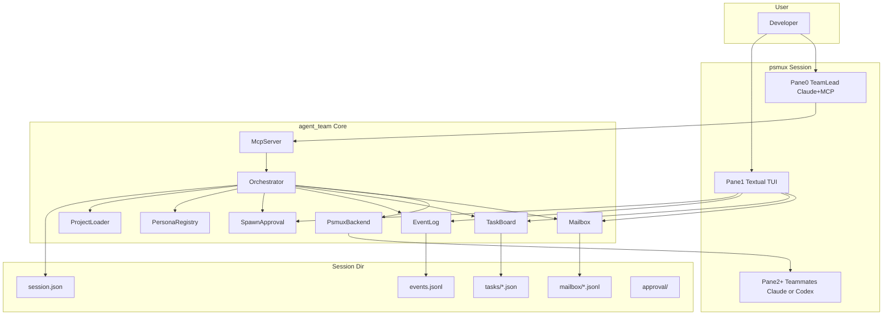

# Architecture

## Overview



## Pane layout (normal mode)

```
+------------------+------------------+
|  Team Lead       |  Textual TUI     |
|  (Claude CLI)    |  Mail/Task/Log   |
|                  |  Spawn Approve   |
+------------------+------------------+
|  Teammate 1      |  Teammate 2      |
|  (optional)      |  (optional)      |
+------------------+------------------+
```

## Data flow principles

1. **Single source of truth:** `~/.agent-team/sessions/{session-id}/`
2. **No duplicate state** between TUI, MCP, and CLI helpers
3. **Playbook = guide** injected into lead prompt; lead decides spawn timing
4. **Spawn approval** only gate requiring user action in TUI (file/shell approval stays in each CLI pane)

## Session directory layout

```
~/.agent-team/sessions/{session-id}/
  session.json
  events.jsonl
  mailbox/
    lead.jsonl
    planner-1.jsonl
  tasks/
    task-001.json
  approval/
    pending.json          # at most one active request
    resolutions.jsonl
  teammates/
    planner-1/
      AGENTS.md           # Codex only
      spawn-prompt.txt
```

## Consumer project (A project) vs tool repo

| | Tool (`agent-team` repo) | Consumer (`payment-api`) |
|---|---|---|
| Purpose | Build orchestrator CLI | Run agent team on app code |
| Config | `personas/` bundle | `.agent-team/` + `TEAM.md` |
| Install | `pip install -e .` | `agent-team init` once |

See [project-integration.md](project-integration.md).
