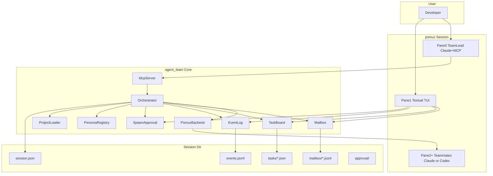

# Architecture

## Overview


```mermaid
flowchart TB
  subgraph user [User]
    Dev[Developer]
  end

  subgraph psmux [psmux Session]
    LeadPane["Pane0 TeamLead Claude+MCP"]
    TUIPane["Pane1 Textual TUI"]
    Teammates["Pane2+ Teammates Claude or Codex"]
  end

  subgraph core [agent_team Core]
    Orch[Orchestrator]
    MCP[McpServer]
    Mail[Mailbox]
    Tasks[TaskBoard]
    Events[EventLog]
    Approve[SpawnApproval]
    Psmux[PsmuxBackend]
    Personas[PersonaRegistry]
    ProjLoad[ProjectLoader]
  end

  subgraph storage [Session Dir]
    SessionJson[session.json]
    MailboxDir[mailbox/*.jsonl]
    TasksDir[tasks/*.json]
    EventsFile[events.jsonl]
    ApprovalDir[approval/]
  end

  Dev --> LeadPane
  Dev --> TUIPane
  LeadPane --> MCP
  MCP --> Orch
  Orch --> Psmux
  Orch --> Mail
  Orch --> Tasks
  Orch --> Events
  Orch --> Approve
  Orch --> Personas
  Orch --> ProjLoad
  Psmux --> Teammates
  TUIPane --> Mail
  TUIPane --> Tasks
  TUIPane --> Events
  TUIPane --> Approve
  Mail --> MailboxDir
  Tasks --> TasksDir
  Events --> EventsFile
  Orch --> SessionJson
```

## Pane layout (normal mode)

```
+------------------+------------------+
|  Team Lead       |  Textual TUI     |
|  (Claude CLI)    |  Mail/Task/Log   |
|                  |  Spawn Approve   |
+------------------+------------------+
|  Teammate 1      |  Teammate 2      |
|  (optional)      |  (optional)      |
+------------------+------------------+
```

## Terminal backend abstraction (S13)

Panes are driven through one `TerminalBackend` interface; a factory picks the OS
implementation. The orchestrator and runner never name a backend directly.

```
            ┌──────────────────────┐
            │  TerminalBackend      │  (split_pane / send_keys / capture_pane /
            │  (abstract interface) │   pipe_pane / kill_pane / list_panes)
            └──────────┬───────────┘
                       │  make_backend()  ← factory, OS-selected
            ┌──────────┴───────────┐
            ▼                      ▼
    ┌───────────────┐      ┌───────────────┐
    │ PsmuxBackend  │      │ TmuxBackend   │
    │ Windows       │      │ Linux / macOS │
    │ (psmux 0.4.10+)│     │ (tmux ≥ 3.4)  │
    └───────────────┘      └───────────────┘
```

## Daemon lifecycle (S18)

`start` can run headless/autonomous; the session terminates through one of four
paths, each converging on a single `final=true` result manifest that an external
consumer (Hermes) reads. Hermes ignores any non-final manifest (mid-run read guard).

```
                 agent-team start [--autonomous --timeout N]
                            │
                            ▼
                   ┌────────────────┐
       ┌──────────►│    RUNNING     │◄─────────┐
       │           └───┬───┬───┬────┘          │
       │   stop marker │   │   │ SIGTERM       │ --timeout elapsed
       │  (agent-team  │   │   │ (container/    │ (kill-all-panes)
       │     stop)     │   │   │  kill)         │
       ▼               ▼   │   ▼               ▼
  STOPPED         STOPPED  │  GRACEFUL      TIMED_OUT
  (clean exit)             │  (SIGTERM       (kill panes)
                           │   handler)
                  crash ◄──┘
                  (orphan panes reaped by next `stop`)
                            │
                            ▼
            write final result_manifest.json (session_status = terminal)
                            │
                            ▼
                   Hermes consumes (final=true only)
```

## Data flow principles

1. **Single source of truth:** `~/.agent-team/sessions/{session-id}/`
2. **No duplicate state** between TUI, MCP, and CLI helpers
3. **Playbook = guide** injected into lead prompt; lead decides spawn timing
4. **Spawn approval** is the only gate requiring an approver. Resolve it interactively in the TUI **or** headless via the external-approver CLI (`agent-team approvals approve/deny`, S18a) — the approval gate itself is unchanged (file/shell approval still stays in each CLI pane).
5. **Projections, not new stores** (S14/S16): `agent-team status` (health) and `logs manifest` / `result_manifest.json` are read-time projections over the existing stores — never a second source of truth.
6. **MCP surface:** the lead drives the team through 11 MCP tools (S11a added event-driven `get_recent_events` / `wait_for_event` so the lead waits without polling/token burn).

## Session directory layout

```
~/.agent-team/sessions/{session-id}/
  session.json
  events.jsonl
  result_manifest.json    # S16: cached read-only projection, written at session end (final=true)
  stop.marker             # S18b: graceful-stop signal (polled by block_until_stopped)
  lead/
    AGENTS.md             # S11c: codex lead working-root context (codex lead only)
  mailbox/
    lead.jsonl
    planner-1.jsonl
  tasks/
    task-001.json
  approval/
    pending.json          # at most one active request
    resolutions.jsonl
  teammates/
    planner-1/
      AGENTS.md           # Codex only
      spawn-prompt.txt
      transcript.log      # S11b: pane output piped to disk (never enters lead context)
```

Worktree isolation (S17, opt-in `isolate_worktrees`): each `workspace-write` persona
runs in its own `git worktree` (created at spawn, pruned at shutdown) so two writers
editing the same file can't collide. Created outside the session dir, under the
consumer repo's worktree root.

## Consumer project (A project) vs tool repo

| | Tool (`agent-team` repo) | Consumer (`payment-api`) |
|---|---|---|
| Purpose | Build orchestrator CLI | Run agent team on app code |
| Config | `personas/` bundle | `.agent-team/` + `TEAM.md` |
| Install | `pip install -e .` | `agent-team init` once |

See [project-integration.md](project-integration.md).
