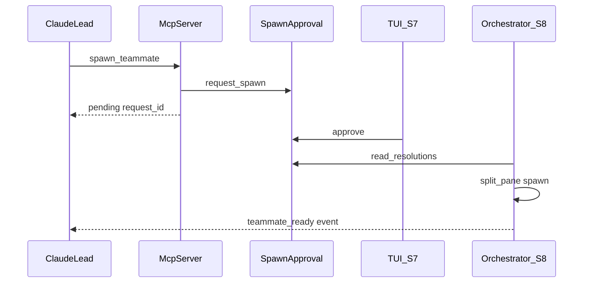

# S6 API Sketch — MCP Server

Review input for 5-expert gate. Implementation follows after BLOCKING=0.

## Design decisions

| Item | Decision |
|------|----------|
| Framework | Official `mcp` SDK — `mcp.server.fastmcp.FastMCP`; stdio transport only (S6) |
| Entry | `python -m agent_team.mcp_server` → `src/agent_team/mcp_server.py` with `if __name__ == "__main__"` |
| Audience | Team Lead (Claude) only; teammates use `agent-team` CLI (S3) |
| Session | `AGENT_TEAM_SESSION_ID` required → `SessionStore.session_dir(id)`; missing → tool error |
| Project | `AGENT_TEAM_PROJECT_PATH` checked in `list_personas` / `spawn_teammate` only via `_require_project(ctx)`; other tools skip |
| Architecture | S6 calls core modules directly (same as S3 CLI); orchestrator wiring is S8 |
| Mutations | All handlers use `ctx.event_log` (single `EventLog` per `McpContext`) |
| max_teammates | `spawn_teammate` rejects when `count(role=="teammate") >= session.max_teammates`; S8 re-checks at pane spawn |
| spawn_teammate | Returns `{request_id, status:"pending"}` only — **not** `{name, pane_id, status:"ready"}` |
| spawn ready | S8 orchestrator spawns pane after TUI approve; `teammate_ready` event notifies lead |
| poll tool | No `poll_spawn_status` in S6 (scope creep) |
| read_messages | Lead inbox only; `since` optional ISO8601; no `--since last` cursor (CLI-only, S3) |
| claim_task | `assignee` defaults to `"lead"` when omitted |
| shutdown | `kill_pane` when `member.pane_id` set; always remove member + `teammate_shutdown` event |
| Test deps | Injectable `SessionStore`, `SpawnApproval`, `PsmuxBackend`; default real instances in production |

## spawn_teammate async flow (spec resolution)

IMPLEMENTATION §MCP flow step 3 (`ready` return) applies to **post-approval orchestration**, not the initial MCP tool response.



## Session context

```python
@dataclass
class McpContext:
    session_id: str
    session_dir: Path
    project_path: Path
    store: SessionStore
    registry: PersonaRegistry
    approval: SpawnApproval
    psmux: PsmuxBackend
    event_log: EventLog

def resolve_context(
    *,
    session_id: str | None = None,
    project_path: str | None = None,
    store: SessionStore | None = None,
    approval: SpawnApproval | None = None,
    psmux: PsmuxBackend | None = None,
) -> McpContext:
    """Read env when args omitted. Requires AGENT_TEAM_SESSION_ID always.
    project_path from env or arg; may be empty until _require_project()."""

def _require_project(ctx: McpContext) -> Path:
    """Raises McpConfigError if ctx.project_path unset (persona/spawn tools)."""
```

| Env var | Required | Use |
|---------|----------|-----|
| `AGENT_TEAM_SESSION_ID` | yes (all tools) | `store.session_dir(session_id)`; validate `session.json` exists |
| `AGENT_TEAM_PROJECT_PATH` | yes (`list_personas`, `spawn_teammate`) | `_require_project` → `PersonaRegistry` + `ProjectLoader` |
| `AGENT_TEAM_HOME` | no | `SessionStore.base_dir` override (tests) |

```python
class McpConfigError(RuntimeError): ...
class McpToolError(RuntimeError):
    """Domain errors surfaced to MCP client as tool error text."""
```

Production: `resolve_context()` reads env. Tests: pass explicit `session_id`, `project_path`, inject mocks.

## MCP tools (9)

### `list_personas`

**Input:** `{}`

**Output:**

```json
{
  "personas": [
    {"name": "planner", "cli": "claude", "description": "..."}
  ]
}
```

**Logic:**

```python
project_path = _require_project(ctx)
config = ProjectLoader(project_path).load_config()
allowed = config.get("allowed_personas", [])
personas = ctx.registry.filter_allowed(allowed)
return {"personas": [{"name": p.name, "cli": p.cli, "description": p.description} for p in personas]}
```

### `spawn_teammate`

**Input:** `{persona: str, name?: str, prompt: str}`

**Output:** `{request_id: str, status: "pending"}`

**Logic:**

```python
project_path = _require_project(ctx)
config = ProjectLoader(project_path).load_config()
allowed = config.get("allowed_personas", [])
if not ctx.registry.is_allowed(persona, allowed):
    raise McpToolError(f"Persona not allowed: {persona}")
session = ctx.store.load(ctx.session_id)
teammate_count = sum(1 for m in session.members if m.role == "teammate")
if teammate_count >= session.max_teammates:
    raise McpToolError(f"Max teammates reached: {session.max_teammates}")
persona_obj = ctx.registry.get(persona)
req = ctx.approval.request_spawn(
    ctx.session_dir,
    persona=persona,
    cli=persona_obj.cli,
    prompt=prompt,
    requested_by="lead",
    teammate_name=name,
    event_log=ctx.event_log,
)
return {"request_id": req.request_id, "status": "pending"}
```

`name` maps to S5 `teammate_name`. Omitted → `null` in pending; S8 generates name if still null.

**Not in S6:** approve, spawn pane, return `ready`.

### `shutdown_teammate`

**Input:** `{name: str}`

**Output:** `{name: str, status: "shutdown"}`

**Logic:**

```python
safe_segment(name, "teammate")
session = ctx.store.load(ctx.session_id)
member = _find_teammate(session.members, name)  # role=="teammate" only
if member is None:
    raise McpToolError(f"Teammate not found: {name}")
if member.pane_id:
    ctx.psmux.kill_pane(member.pane_id)
updated = [m for m in session.members if m.name != name]
ctx.store.update_members(ctx.session_id, updated)
ctx.event_log.append(ctx.session_dir, type_="teammate_shutdown", payload={"name": name})
return {"name": name, "status": "shutdown"}
```

Lead member cannot be shut down via this tool (`role != "teammate"` → not found).

### `send_message`

**Input:** `{to: str, body: str}`

**Output:** `{id: str, to: str, ts: str}`

**Logic:** `mailbox.send(session_dir, from_="lead", to=to, body=body, event_log=ctx.event_log)` → return id/to/ts.

`safe_segment(to, "recipient")` via mailbox.send.

### `read_messages`

**Input:** `{since?: str}` — ISO8601 UTC (same format as mailbox `parse_since`)

**Output:**

```json
{
  "messages": [
    {"id": "...", "from": "planner-1", "to": "lead", "body": "...", "ts": "..."}
  ]
}
```

**Logic:** `read_inbox(ctx.session_dir, "lead", since=since)`; serialize `from_` as `"from"`.

### `create_task`

**Input:** `{title: str, description?: str, deps?: list[str]}`

**Output:** `{task_id: str, title: str, state: "pending"}`

**Logic:** `tasks.create_task(..., event_log=ctx.event_log)`.

### `claim_task`

**Input:** `{task_id: str, assignee?: str}`

**Output:** `{task_id: str, assignee: str, state: "in_progress"}`

**Logic:** `assignee = assignee or "lead"`; `safe_segment(assignee, "assignee")`; `tasks.claim_task(..., event_log=ctx.event_log)`.

### `complete_task`

**Input:** `{task_id: str}`

**Output:** `{task_id: str, state: "completed"}`

**Logic:** `tasks.complete_task(..., event_log=ctx.event_log)`.

### `list_teammates`

**Input:** `{}`

**Output:**

```json
{
  "members": [
    {
      "name": "lead",
      "role": "lead",
      "persona": null,
      "cli": "claude",
      "pane_id": "%0",
      "backend": "psmux",
      "status": "running"
    }
  ]
}
```

**Logic:** `member_to_response(m)` for each member — keys: `name`, `role`, `persona`, `cli`, `pane_id`, `backend`, `status` (matches session.json).

## `mcp_server.py`

### FastMCP wiring

```python
from mcp.server.fastmcp import FastMCP

mcp = FastMCP("agent-team")

@mcp.tool()
def list_personas() -> dict: ...

# ... 8 more tools — each resolves McpContext, catches domain errors → McpToolError text

def main() -> None:
    mcp.run(transport="stdio")

if __name__ == "__main__":
    main()
```

Tool implementations delegate to testable handler functions:

```python
def handle_list_personas(ctx: McpContext) -> dict: ...
def handle_spawn_teammate(ctx: McpContext, persona: str, prompt: str, name: str | None = None) -> dict: ...
# ... etc
```

### Error mapping

| Domain exception | MCP behavior |
|------------------|--------------|
| `McpConfigError` | tool error: message |
| `McpToolError` | tool error: message |
| `SessionNotFoundError` | tool error |
| `PersonaNotFoundError` | tool error |
| `SpawnPendingError` | tool error |
| `InvalidPathSegmentError` | tool error |
| `TaskNotFoundError`, `TaskDependencyError`, `TaskStateError` | tool error |
| `ProjectConfigError` | tool error (spawn/list_personas when config missing) |
| `PsmuxCommandError` | tool error (shutdown with real backend) |
| `ValueError` | tool error (invalid `since` ISO in `read_messages`; catch at handler) |

No stack traces to client. Non-domain exceptions → generic tool error string (no stack).

## Event payloads (mutations)

| Tool | Event type | Payload keys |
|------|------------|--------------|
| spawn_teammate | `spawn_requested` | `request_id`, `persona`, `cli`, `requested_by` |
| send_message | `mail_sent` | `from`, `to`, `id` |
| create_task | `task_created` | `task_id`, `title` |
| claim_task | `task_claimed` | `task_id`, `assignee` |
| complete_task | `task_completed` | `task_id` |
| shutdown_teammate | `teammate_shutdown` | `name` |

## CLI ↔ MCP parity

| CLI (S3) | MCP tool |
|----------|----------|
| `personas list` | `list_personas` (MCP filters by allowed_personas) |
| — | `spawn_teammate` |
| — | `shutdown_teammate` |
| `mail send --as lead` | `send_message` |
| `mail read --as lead` | `read_messages` (no `last` cursor) |
| `task create` | `create_task` |
| `task claim` | `claim_task` (MCP defaults `assignee` to `lead`; CLI requires `--assignee`) |
| `task complete` | `complete_task` |
| — | `list_teammates` |

CLI-only (no MCP): `task list`, `logs *`, `context show`, `init`.

## Test matrix (20)

| # | Test | Scenario |
|---|------|----------|
| 1 | list_personas | allowed filter; disallowed persona omitted |
| 2 | spawn_teammate | pending written; `spawn_requested` event |
| 3 | spawn_teammate | disallowed persona → error |
| 4 | spawn_teammate | duplicate pending → `SpawnPendingError` text |
| 5 | list_teammates | returns session members JSON |
| 6 | send_message | mailbox line + `mail_sent` |
| 7 | read_messages | since filter excludes older |
| 8 | create_task | task file + `task_created` |
| 9 | claim_task | default assignee `lead` |
| 10 | claim_task | deps incomplete → error |
| 11 | complete_task | state completed + event |
| 12 | shutdown_teammate | mock psmux `kill_pane` recorded; member removed; `teammate_shutdown` |
| 13 | shutdown_teammate | `pane_id` null → no `kill_pane`; member still removed |
| 14 | shutdown_teammate | `name="lead"` → not found error |
| 15 | spawn_teammate | at `max_teammates` cap → error |
| 16 | list_personas / spawn | missing `AGENT_TEAM_PROJECT_PATH` → `McpConfigError` |
| 17 | read_messages | invalid `since` → error |
| 18 | send_message | bad `to` segment → `InvalidPathSegmentError` text |
| 19 | claim_task | `TaskNotFoundError` on unknown id |
| 20 | resolve_context | missing `AGENT_TEAM_SESSION_ID` → `McpConfigError` |

`spawn_denied` is **not** an MCP tool — denial is S7 TUI / `SpawnApproval.deny` only.

### Test strategy

- Primary: `handle_*` + `McpContext` (no stdio subprocess required for gate)
- Optional: one in-process `ClientSession` smoke calling all 9 tools
- `PsmuxBackend(mock=True)` for shutdown; assert `recorded_calls`

### `mcp_context` fixture (extend conftest)

```python
@pytest.fixture
def mcp_context(
    session_store: SessionStore,
    consumer_project: Path,
    psmux_backend: PsmuxBackend,
    event_log: EventLog,
    persona_registry: PersonaRegistry,
) -> McpContext:
    session = session_store.create(
        session_id="mcp-test",
        project_path=str(consumer_project),
        psmux_session="mcp-test",
        max_teammates=5,
        members=[
            Member(name="lead", role="lead", ..., status="running"),
            Member(name="helper-1", role="teammate", persona="planner",
                   cli="claude", pane_id="%1", backend="psmux", status="running"),
        ],
    )
    return McpContext(
        session_id=session.session_id,
        session_dir=session_store.session_dir(session.session_id),
        project_path=consumer_project,
        store=session_store,
        registry=PersonaRegistry(project_path=consumer_project, global_dir=...),
        approval=SpawnApproval(),
        psmux=psmux_backend,
        event_log=event_log,
    )
```

## Dependencies

```toml
# pyproject.toml [project] dependencies
"mcp>=1.0,<2",
```

No separate `fastmcp` PyPI package — use SDK-bundled `FastMCP` from `mcp.server.fastmcp`.

**Note:** Align `IMPLEMENTATION.md` §Dependencies S6 row to `mcp>=1.0` at implement time (replaces "mcp or fastmcp").

## Files (post-gate)

| File | Role |
|------|------|
| `src/agent_team/mcp_server.py` | FastMCP tools + handlers + `main()` |
| `tests/unit/test_mcp_server.py` | 16+ tests |
| `pyproject.toml` | add `mcp` dependency |
| `PROGRESS.md` | S6 done after implement + code gate |

## Out of scope (S6)

- TUI approval modal (S7)
- Orchestrator spawn after approve (S8)
- `teammate_ready` emission on spawn (S8)
- `poll_spawn_status` MCP tool
- HTTP/SSE MCP transport
- Writing `teammates/{name}/spawn-prompt.txt` (S8)
- Real psmux integration test (mock only S0–S8)
- `spawn_denied` / MCP approve-deny (S7 TUI + S5 API)

## Downstream (S7/S8/S9)

```python
# S7 TUI — same SpawnApproval files; no MCP dependency
pending = approval.get_pending(session_dir)

# S8 orchestrator — reads approved resolution, not MCP return value
for res in approval.read_resolutions(session_dir):
    if res.decision == "approved" and not already_spawned(res.request_id):
        pane_id = backend.split_pane(psmux_session, command=cmd, cwd=project_path)
        store.update_members(...)  # add teammate Member
        event_log.append(..., type_="teammate_ready", payload={"name": name, "pane_id": pane_id})

# S9 manual — claude-mcp.json.example env vars set by `agent-team start`
```

S6 must not block S8: approved resolution snapshot fields unchanged from S5.
