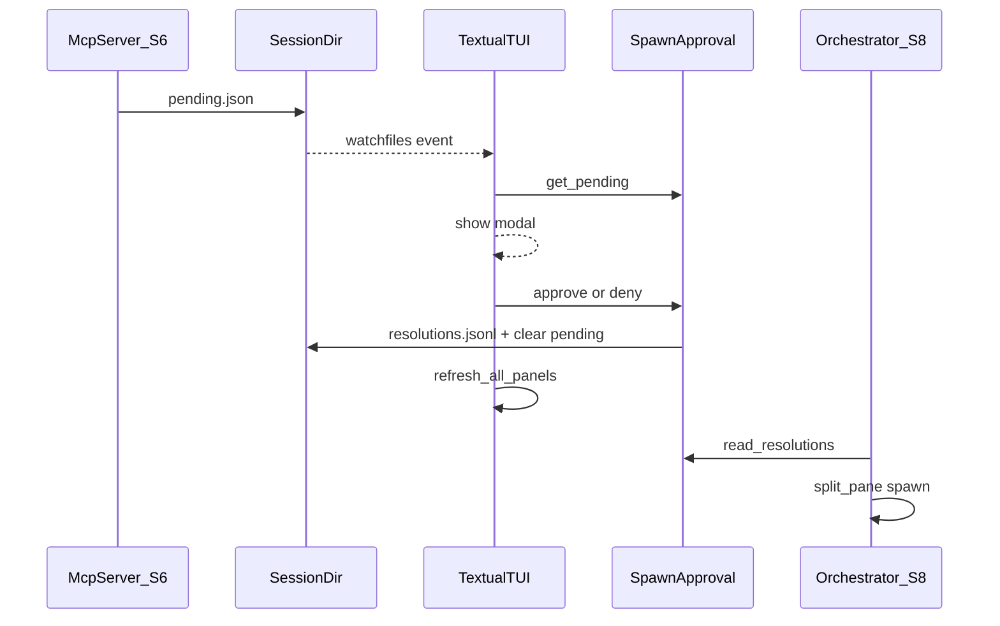

# S7 API Sketch — Textual TUI

Review input for 6-expert gate. Implementation follows after BLOCKING=0.

## Design decisions

| Item | Decision |
|------|----------|
| Framework | Textual `>=1.0`; file watch via `watchfiles>=0.21` |
| Entry CLI | `agent-team tui [--session ID]` — `--session` optional if `AGENT_TEAM_SESSION_ID` set |
| Entry module | `python -m agent_team.tui` — **S8 pane path**; session from `AGENT_TEAM_SESSION_ID` env |
| S8 launch | `sys.executable -m agent_team.tui` with `AGENT_TEAM_HOME` + `AGENT_TEAM_SESSION_ID`; `cwd=project_path` |
| Layout | 2×2 grid: Mail / Tasks / Team / Log ([blueprint](blueprints/s7-tui.html)) |
| UI language | English labels (match CLI); Korean blueprint is reference only |
| Data | Read-only panels; **only** mutations are spawn approve/deny via `SpawnApproval` |
| Mail scope | All `mailbox/*.jsonl` merged, sorted by `ts` desc (team observer view) |
| Tasks | `list_tasks(session_dir)` read-only; map `Task.id` → `task_id` |
| Team | `SessionStore.load(session_id).members` read-only (no empty-slot placeholders in S7) |
| Log | `EventLog.tail(session_dir, n=50)` |
| Watch | `watchfiles.awatch(session_dir, recursive=True)`; debounce 200ms; `F5` manual refresh |
| Modal | `get_pending` on each refresh; forced modal while pending exists |
| Approve/Deny | `ctx.approval.approve/deny(..., decided_by="user", event_log=ctx.event_log)` |
| Post-mutation | After approve/deny success → `refresh_all_panels(app)` (Log + modal check) |
| Post-approve | **No** pane spawn, **no** `teammate_ready` — S8 polls `resolutions.jsonl` |
| Impl order | Mail + Log → Tasks + Team → approval modal |

## Dual entry (BLOCKING resolution)

| Path | Session resolution |
|------|-------------------|
| `agent-team tui --session ID` | Manual dev; `--session` required unless `AGENT_TEAM_SESSION_ID` also set |
| `python -m agent_team.tui` | S8 psmux pane; **no argv**; `AGENT_TEAM_SESSION_ID` required |

Both call `resolve_tui_context()` then `AgentTeamApp(ctx).run()`.

## Approval flow (S7 scope)



## Session context

```python
@dataclass
class TuiContext:
    session_id: str
    session_dir: Path
    store: SessionStore
    approval: SpawnApproval
    event_log: EventLog

def resolve_tui_context(
    *,
    session_id: str | None = None,
    store: SessionStore | None = None,
    approval: SpawnApproval | None = None,
    event_log: EventLog | None = None,
) -> TuiContext:
    sid = session_id or os.environ.get("AGENT_TEAM_SESSION_ID")
    if not sid:
        raise TuiConfigError("Session id required: --session or AGENT_TEAM_SESSION_ID")
    session_store = store or SessionStore()
    session_store.load(sid)  # SessionNotFoundError if missing
    return TuiContext(
        session_id=sid,
        session_dir=session_store.session_dir(sid),
        store=session_store,
        approval=approval or SpawnApproval(),
        event_log=event_log or EventLog(),
    )

class TuiConfigError(RuntimeError): ...
```

| Env var | Use |
|---------|-----|
| `AGENT_TEAM_SESSION_ID` | Module entry (S8); CLI fallback |
| `AGENT_TEAM_HOME` | `SessionStore.base_dir` override (tests) |

## Layout

```
┌─────────────────────────────────────────────────────────┐
│ agent-team TUI — session: {id} · {n}/{max} teammates    │
├──────────────────────┬──────────────────────────────────┤
│ Mail                 │ Tasks                            │
├──────────────────────┼──────────────────────────────────┤
│ Team                 │ Event Log                        │
├──────────────────────┴──────────────────────────────────┤
│ [Tab] focus  [F5] refresh  [?] help                     │
└─────────────────────────────────────────────────────────┘
```

Tab focus order (when no modal): Mail → Tasks → Team → Event Log → wrap.

When spawn modal open: Tab cycles Approve ↔ Deny buttons only; panels not focusable.

## Data loaders (`loaders.py`)

```python
def load_mail_rows(session_dir: Path, *, limit: int = 100) -> list[MailRow]: ...

def load_task_rows(session_dir: Path) -> list[TaskRow]:
    """tasks.list_tasks; Task.id → TaskRow.task_id."""

def load_member_rows(session: Session) -> list[MemberRow]: ...

def format_event_summary(event: Event) -> str: ...

def load_event_rows(session_dir: Path, *, n: int = 50) -> list[EventRow]:
    """EventLog.tail + format_event_summary per row."""
```

**Canonical `format_event_summary`:**

| type | summary |
|------|---------|
| `spawn_requested` | `spawn_requested {request_id} {persona}` |
| `mail_sent` | `mail_sent {from} → {to}` |
| `task_claimed` | `task_claimed {task_id} {assignee}` |
| `task_created` | `task_created {task_id} {title}` |
| `task_completed` | `task_completed {task_id}` |
| `spawn_approved` | `spawn_approved {request_id} {persona}` |
| `spawn_denied` | `spawn_denied {request_id}` |
| `teammate_shutdown` | `teammate_shutdown {name}` |
| other | `{type}` |

## Panel widgets

| Module | Widget | Refresh |
|--------|--------|---------|
| `panels/mail.py` | `MailPanel` | `refresh(session_dir)` |
| `panels/tasks.py` | `TasksPanel` | `refresh(session_dir)` |
| `panels/team.py` | `TeamPanel` | `refresh(ctx)` — loads session via `ctx.store.load(ctx.session_id)` |
| `panels/log.py` | `LogPanel` | `refresh(session_dir)` |

## File watch

```python
def refresh_all_panels(app: AgentTeamApp) -> None:
    ctx = app.ctx
    app.mail.refresh(ctx.session_dir)
    app.tasks.refresh(ctx.session_dir)
    app.team.refresh(ctx)
    app.log.refresh(ctx.session_dir)
    app.check_spawn_modal()
```

Tests call `refresh_all_panels()` directly (no watchfiles thread).

## Spawn approval modal (`modal.py`)

**English UI copy:**

| Label | Example |
|-------|---------|
| Title | `Spawn approval` |
| Persona | `Persona: planner (claude)` |
| Teammate | `Teammate: planner-1` or `Teammate: —` |
| Requested by | `Requested by: lead` |
| Count | `Teammates: 2 / 5` |
| Preview | (multiline `prompt_preview`) |
| Buttons | `Approve (Y)` / `Deny (N)` |

```python
def handle_approve(ctx: TuiContext, request_id: str) -> SpawnResolution:
    return ctx.approval.approve(
        ctx.session_dir,
        request_id,
        decided_by="user",
        event_log=ctx.event_log,
    )

def handle_deny(ctx: TuiContext, request_id: str) -> SpawnResolution:
    return ctx.approval.deny(
        ctx.session_dir,
        request_id,
        decided_by="user",
        event_log=ctx.event_log,
    )
```

`SpawnApprovalModal` BINDINGS: `y` → approve, `n` → deny, `escape` → no-op when pending.

On approve/deny success: `refresh_all_panels(app)` then dismiss modal.

`check_spawn_modal()`: pending → push modal if absent; no pending → pop modal if shown.

Resolution snapshot delegated to S5 `SpawnApproval.approve` (no TUI assembly).

## `app.py`

```python
class AgentTeamApp(App):
    BINDINGS = [
        Binding("f5", "refresh", "Refresh"),
        Binding("tab", "focus_next", "Next panel"),
        Binding("question_mark", "help", "Help"),
    ]

    def action_help(self) -> None:
        self.push_screen(HelpScreen())  # lists Tab, F5, Y/N when modal open
```

## CLI (`cli/tui_cmd.py`)

```python
@click.command("tui")
@click.option("--session", default=None, help="Session id (or AGENT_TEAM_SESSION_ID)")
def tui_cmd(session: str | None) -> None:
    try:
        ctx = resolve_tui_context(session_id=session)
    except (TuiConfigError, SessionNotFoundError) as exc:
        echo_error(str(exc))
    AgentTeamApp(ctx).run()
```

## Module entry (`tui/__main__.py`)

```python
def main() -> None:
    try:
        ctx = resolve_tui_context()
    except TuiConfigError as exc:
        print(exc, file=sys.stderr)
        raise SystemExit(1) from exc
    except SessionNotFoundError as exc:
        print(exc, file=sys.stderr)
        raise SystemExit(1) from exc
    AgentTeamApp(ctx).run()

if __name__ == "__main__":
    main()
```

## Error handling

| Case | Behavior |
|------|----------|
| Missing session id | `TuiConfigError` → CLI `echo_error` / module exit 1 |
| Session not found | `SessionNotFoundError` → exit 1 |
| Approve with no pending | `SpawnRequestNotFoundError` → toast, stay on modal |

## Test matrix (11)

| # | Test file | Scenario |
|---|-----------|----------|
| 1 | `test_tui_loaders` | two mailboxes merged, newest first |
| 2 | `test_tui_loaders` | event summaries: spawn_requested, mail_sent, task_claimed |
| 3 | `test_tui_loaders` | task states from fixtures |
| 4 | `test_tui_loaders` | lead + teammate member rows |
| 5 | `test_tui_pilot` | `App.run_test()` shows Mail panel header |
| 6 | `test_tui_pilot` | `SpawnApproval.request_spawn` → modal title `Spawn approval` |
| 7 | `test_tui_modal` | `handle_approve` → resolution + `spawn_approved`, `decided_by=user` |
| 8 | `test_tui_modal` | `handle_deny` → minimal resolution + `spawn_denied` |
| 9 | `test_tui_modal` | `handle_approve` no pending → `SpawnRequestNotFoundError` |
| 10 | `test_tui_context` | `AGENT_TEAM_SESSION_ID` env resolves session |
| 11 | `test_tui_refresh` | mailbox write + `refresh_all_panels` → mail row count up |

Pilot: **`App.run_test()` only** (headless; no CI skip).

### Fixtures (`conftest.py`)

```python
@pytest.fixture
def tui_session(session_store: SessionStore) -> Session:
    return session_store.create(
        session_id="tui-test",
        project_path="c:\\DEV\\test",
        psmux_session="tui-test",
        max_teammates=5,
        members=[
            Member(name="lead", role="lead", ...),
            Member(name="helper-1", role="teammate", persona="planner", ...),
        ],
    )

@pytest.fixture
def tui_context(tui_session, session_store, event_log) -> TuiContext:
    return resolve_tui_context(
        session_id=tui_session.session_id,
        store=session_store,
        event_log=event_log,
    )
```

## Dependencies

```toml
"textual>=1.0",
"watchfiles>=0.21",
```

## Files (post-gate)

| File | Role |
|------|------|
| `src/agent_team/tui/app.py` | `AgentTeamApp`, refresh, help |
| `src/agent_team/tui/panels/*.py` | four panels |
| `src/agent_team/tui/modal.py` | modal + `handle_approve` / `handle_deny` |
| `src/agent_team/tui/loaders.py` | pure loaders + `format_event_summary` |
| `src/agent_team/tui/context.py` | `TuiContext`, `resolve_tui_context` |
| `src/agent_team/tui/__main__.py` | module entry (S8) |
| `src/agent_team/cli/tui_cmd.py` | `agent-team tui` |
| `tests/unit/test_tui_loaders.py` | rows 1–4 |
| `tests/unit/test_tui_modal.py` | rows 7–9 |
| `tests/unit/test_tui_context.py` | row 10 |
| `tests/tui/test_tui_pilot.py` | rows 5–6 |
| `tests/unit/test_tui_refresh.py` | row 11 |

## Out of scope (S7)

- Orchestrator / `agent-team start` (S8)
- Pane spawn / `teammate_ready` (S8)
- Mail/task mutations from TUI
- Team panel empty-slot placeholders (blueprint cosmetic)
- Real watchfiles thread in unit tests

## Downstream (S8/S9)

```python
# S8 — TUI pane (consumer project cwd)
env = {
    "AGENT_TEAM_HOME": str(store.base_dir),
    "AGENT_TEAM_SESSION_ID": session.session_id,
}
cmd = f"{sys.executable} -m agent_team.tui"
backend.split_pane(psmux_session, command=cmd, cwd=Path(session.project_path), env=env)

# S8 spawn loop (orchestrator, not TUI)
for res in approval.read_resolutions(session_dir):
    if res.decision == "approved" and not spawned(res.request_id):
        pane_id = backend.split_pane(...)
        event_log.append(..., type_="teammate_ready", payload={"name": name, "pane_id": pane_id})
```

S9 manual: after approve, verify Log panel shows `spawn_approved` (optional checkbox in s9 doc at implement time).

S7 must not block S8: `resolutions.jsonl` approved snapshot unchanged from S5.
