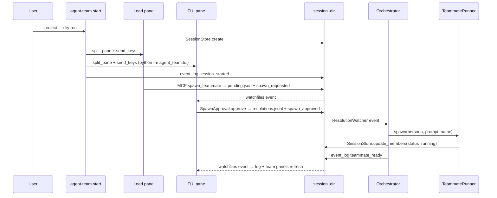

# S8 API Sketch — Orchestrator dry-run

Review input for 5-expert gate. Implementation follows after BLOCKING=0.

## Design decisions

| Item | Decision |
|------|----------|
| Trigger | `watchfiles` (generalize s7 `SessionWatcher`) — **not** polling. CPU idle 0%, same primitives as TUI. |
| Watch target | `approval/resolutions.jsonl` change → `Orchestrator.run_once()` |
| Idempotency | In-memory `set[request_id]` of already-handled resolutions; also reconcilable via `session.members` (teammate_name match) on `attach`. |
| Orchestrator lifecycle | `agent-team start` parent process; foreground; print "this shell drives the session; do not close" once. |
| Re-entry | `agent-team attach` = psmux re-attach + Orchestrator watch loop re-start. (User-confirmed.) |
| `start` re-run policy | Refuse if `sessions/<id>/session.json` exists; suggest `attach`. Prevents duplicate spawn. |
| `TeammateRunner` shape | Single class + `mock: bool` (same pattern as `PsmuxBackend`). Protocol/ABC = overkill. |
| `--dry-run` semantics | `TeammateRunner(mock=True)` — no real Claude/Codex; records `recorded_spawns`. |
| `--no-psmux` semantics | `PsmuxBackend(mock=True)` — no real psmux; records calls. Orthogonal to `--dry-run`. |
| `teammate_ready` timing | Emitted immediately after `send_keys` returns (or mock spawn records). Real handshake → S9+. |
| `Member.status` values | `"spawning" → "running"` (free-form `str`; do **not** narrow with `Literal`). S9+ adds `"ready"`, `"crashed"`, `"shutdown"`. |
| Member.name auto-id | If `SpawnRequest.teammate_name` is empty: `"helper-{N}"` where N = next free index in `session.members`. |
| New event types | `session_started`, `teammate_ready`. Lower-snake_case payload keys identical to existing types. |
| MCP scope | **No** new MCP tool in S8. Lead's `spawn_teammate` already creates `pending.json`; orchestrator picks up from `resolutions.jsonl`. |
| Shutdown | `Orchestrator.shutdown(session_id)` slot reserved but S8 raises `NotImplementedError`. S9-10 wires `kill_pane` + archive. |
| Test slots | 8 new tests (5 unit + 2 e2e + 1 dedicated `--no-psmux`). Cumulative target ≥ 150. |

## CLI

```
agent-team start --project PATH [--playbook NAME] [--context TEXT] [--dry-run] [--no-psmux]
agent-team attach --session ID
```

| Flag | Behavior |
|------|----------|
| `--project PATH` | Required. Resolves `.agent-team/config.yaml`. |
| `--playbook NAME` | Optional. Loaded from `playbooks/` via existing loader. |
| `--context TEXT` | Optional. Lead context injection (passed to lead prompt). |
| `--dry-run` | `TeammateRunner(mock=True)`. Default `False`. |
| `--no-psmux` | `PsmuxBackend(mock=True)`. Default `False`. Useful for headless tests. |

`start` error paths (all use `cli/_helpers.echo_error`):
- project_path missing or no `.agent-team/config.yaml` → exit 1
- existing session for the same id → "session exists — use `agent-team attach --session ID`" → exit 1
- playbook name not in `playbooks/` → exit 1

`attach` error paths:
- session not found → `SessionNotFoundError` → exit 1
- psmux session missing on host → log warning, continue with file-only orchestrator (`--no-psmux` implied)

## Orchestrator

```python
@dataclass
class OrchestratorContext:
    session_id: str
    session_dir: Path
    store: SessionStore
    approval: SpawnApproval
    runner: TeammateRunner
    psmux: PsmuxBackend
    event_log: EventLog
    no_psmux: bool


class Orchestrator:
    def __init__(self, ctx: OrchestratorContext) -> None: ...

    def start(self, *, project_path: Path, playbook: str | None,
              context_text: str | None) -> None:
        """Create session.json, spawn lead+tui panes, emit session_started,
        scan existing resolutions, then start ResolutionWatcher."""

    def attach(self) -> None:
        """Load existing session, reconcile handled_ids from session.members,
        start ResolutionWatcher."""

    def run_once(self) -> int:
        """Scan resolutions.jsonl; spawn for each approved, unhandled entry.
        Returns number of new teammates spawned. Idempotent."""

    def stop(self) -> None:
        """Stop ResolutionWatcher (graceful)."""

    def shutdown(self) -> None:
        """S9+. Kill panes, archive session. S8 raises NotImplementedError."""
```

### Lifecycle on `start`

```
1. SessionStore.create(session_id, project_path, psmux_session, members=[lead, tui], max_teammates=N)
2. PsmuxBackend.new_session(psmux_session, cwd=project_path)
3. lead_pane = split_pane(...);  send_keys(lead_pane, lead launch cmd)
4. tui_pane  = split_pane(...);  send_keys(tui_pane,  "python -m agent_team.tui")
5. event_log.append("session_started", {session_id, psmux_session, members:[lead.name, tui.name]})
6. run_once()                      # absorb pre-existing resolutions
7. ResolutionWatcher.start()       # watches approval/resolutions.jsonl
8. block on stop event             # foreground; ctrl-C sets stop
```

### Lifecycle on `attach`

```
1. SessionStore.load(session_id)
2. handled_ids = { m.name's request_id ... }   (reconcile)
3. (best effort) psmux send list_panes; warn if missing
4. run_once()
5. ResolutionWatcher.start()
6. block on stop
```

### ResolutionWatcher

Generalize s7 `SessionWatcher` into a reusable primitive in `tui/watcher.py` or new `_watcher.py`:

```python
class FileWatcher:
    """Background watchfiles thread with rate-limit debounce + crash-safe callback."""
    def __init__(self, path: Path, callback: Callable[[], None], *,
                 debounce_ms: int = 200, recursive: bool = False) -> None: ...
    def start(self) -> None: ...
    def stop(self) -> None: ...
```

`SessionWatcher` becomes a thin wrapper (`FileWatcher(session_dir, ..., recursive=True)`); `ResolutionWatcher` watches `session_dir/approval/`. Both reuse the s7 hardening (try/except, rate-limit cancelable via `stop_event`).

## TeammateRunner

```python
@dataclass
class SpawnResult:
    pane_id: str
    teammate_name: str
    started_at: str       # ISO ts


class TeammateRunner:
    def __init__(self, psmux: PsmuxBackend, registry: PersonaRegistry, *,
                 mock: bool = False) -> None:
        self.psmux = psmux
        self.registry = registry
        self.mock = mock
        self.recorded_spawns: list[tuple[str, str, str]] = []   # (persona, prompt, name)

    def spawn(self, *, psmux_session: str, persona: str, prompt: str,
              teammate_name: str, cwd: Path | None = None) -> SpawnResult:
        """Render persona spawn_prompt_template, split pane, send_keys.
        mock=True: record only, return synthetic pane_id."""
```

`mock=True` returns `SpawnResult(pane_id=f"%mock-{len(recorded_spawns)+1}", ...)` and appends to `recorded_spawns`.

## Event additions

| type | payload |
|------|---------|
| `session_started` | `{session_id, psmux_session, members: [name, ...]}` |
| `teammate_ready` | `{request_id, persona, name, pane_id, cli}` |

`tui/loaders.format_event_summary` adds two cases (use `.get()` per s7 rule):
- `session_started` → `f"session_started {payload.get('session_id', '')}"`
- `teammate_ready` → `f"teammate_ready {payload.get('name', '')} ({payload.get('persona', '')})"`

## Flow



## Test slots (S8)

| # | File | Verifies |
|---|------|----------|
| 1 | `tests/unit/test_orchestrator.py::test_start_creates_session_and_events` | session.json, lead+tui members, `session_started` event |
| 2 | `tests/unit/test_orchestrator.py::test_run_once_spawns_for_approved` | mock resolution → `TeammateRunner.spawn` called once |
| 3 | `tests/unit/test_orchestrator.py::test_run_once_emits_teammate_ready` | event payload schema matches table above |
| 4 | `tests/unit/test_orchestrator.py::test_run_once_updates_member_status` | `session.members` gains new Member with `status="running"`, pane_id set |
| 5 | `tests/unit/test_orchestrator.py::test_run_once_idempotent` | same request_id twice → spawn called only once |
| 6 | `tests/integration/test_start_e2e.py` | Click runner: `agent-team start --project P --dry-run --no-psmux`; full path through `Orchestrator.run_once` via watcher; assert session.json + events |
| 7 | `tests/integration/test_attach_e2e.py` | Pre-create session, call `agent-team attach`; queue new resolution; assert spawn happens |
| 8 | `tests/unit/test_orchestrator.py::test_no_psmux_skips_pane_split` | `--no-psmux` → `PsmuxBackend.split_pane` recorded_calls is empty |

All tests use `PsmuxBackend(mock=True)` and `TeammateRunner(mock=True)`. New `Orchestrator` fixture in `tests/conftest.py` composing existing `psmux_backend`, `session_store`, `event_log`.

## Reused utilities

- `agent_team.psmux_backend.PsmuxBackend(mock=True)`
- `agent_team.spawn_approval.SpawnApproval.read_resolutions` + `get_pending`
- `agent_team.personas.PersonaRegistry.get(name).spawn_prompt_template`
- `agent_team.session.SessionStore.update_members`
- `agent_team.event_log.EventLog.append`
- `agent_team.cli._helpers.{resolve_session_dir, echo_error}`
- `agent_team.tui.watcher.SessionWatcher` (generalize to `FileWatcher`)

## Out of scope (S9+)

- Real Claude/Codex teammate processes (S9 `TeammateRunner(mock=False)`)
- `teammate_ready` real handshake via ready-marker file
- `Member.status` values beyond `"spawning"/"running"`
- `Orchestrator.shutdown` (kill_pane + archive)
- Multi-session orchestrator (one session per `start`)
- New MCP tools (e.g., `list_teammates_ready`)
